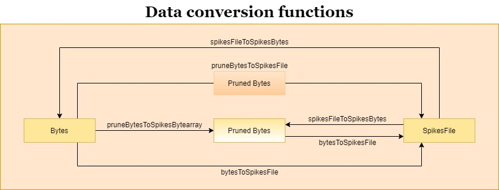

Data conversion functions 
-------------------------

This section shows the different conversion functions used in AERzip. As with the compression functions, there is a picture showing the functions needed to convert a data type into another, in the context of uncompressed data.

There is the list of conversion functions:

.. automodule:: AERzip.conversionFunctions